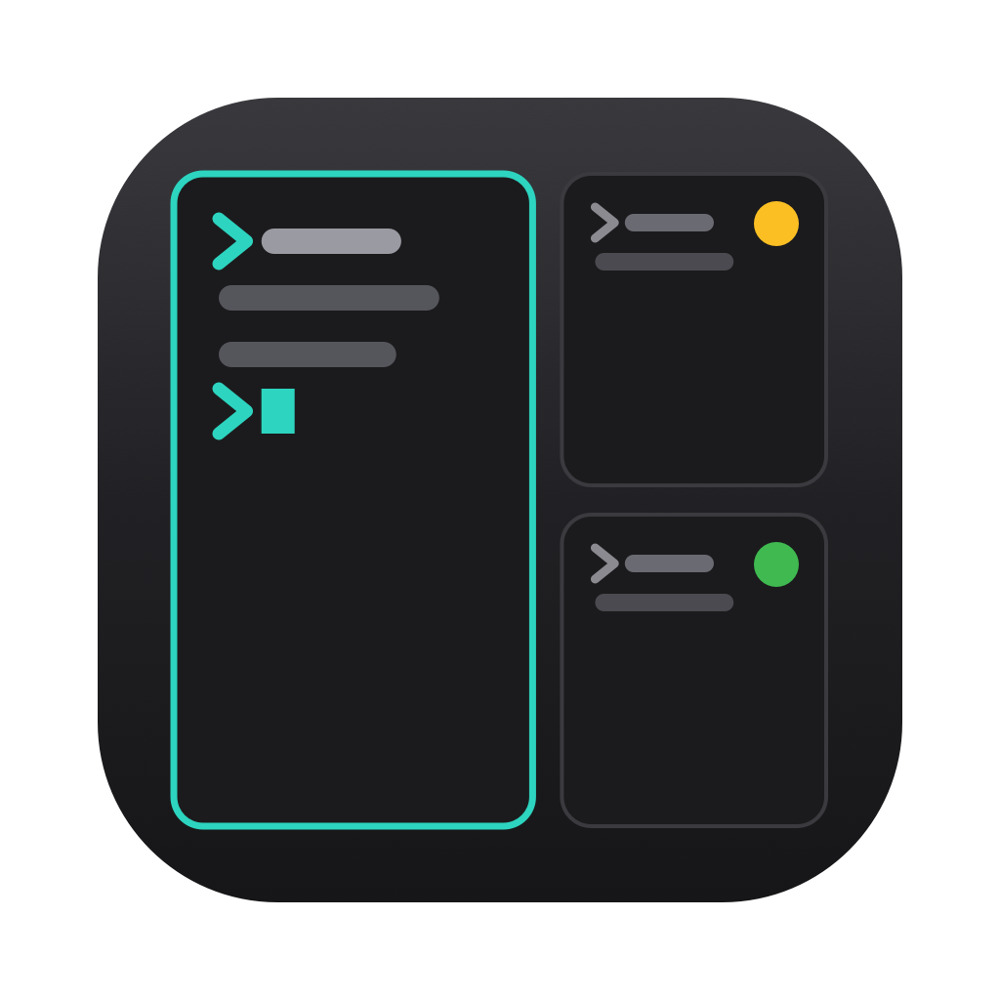
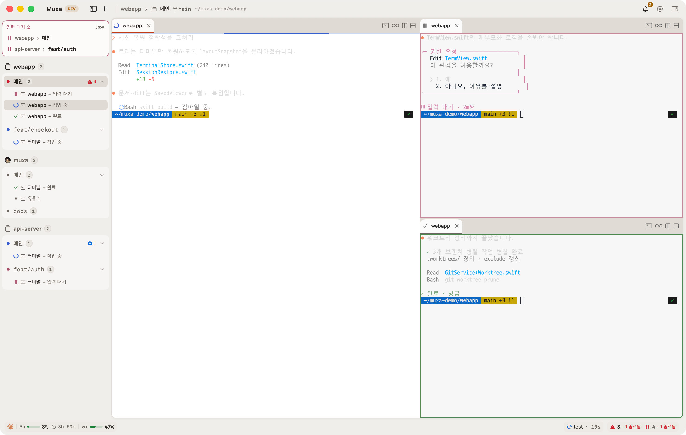
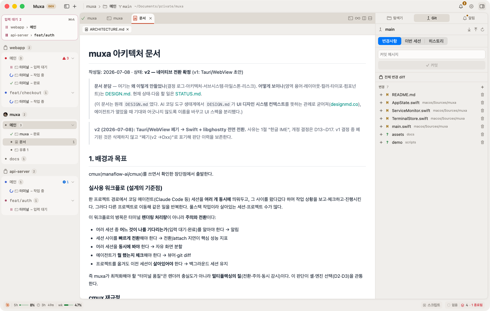
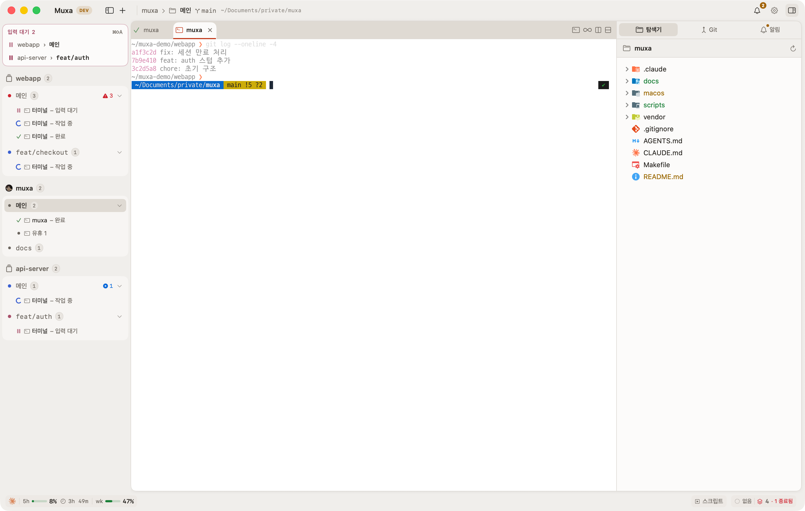
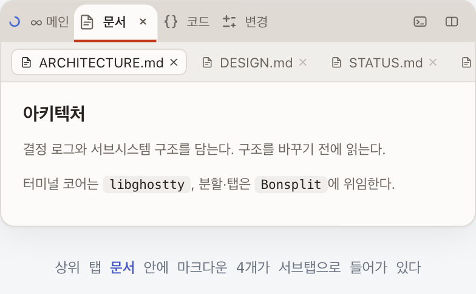
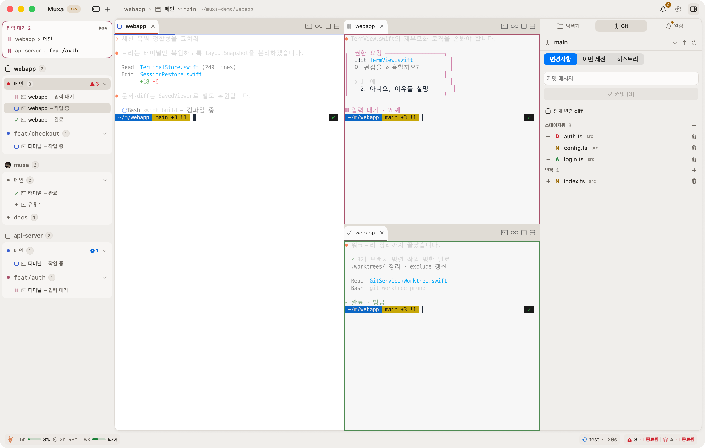
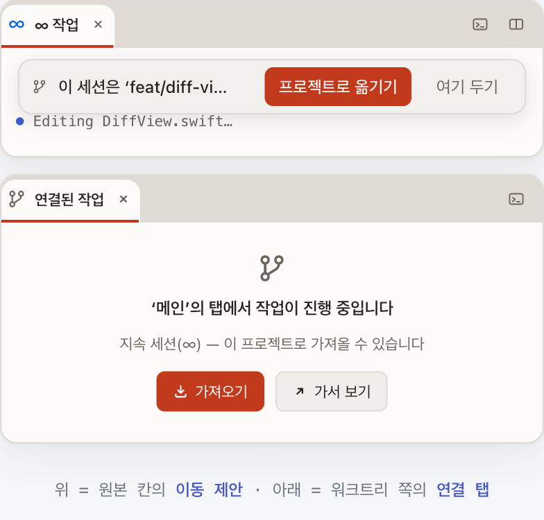
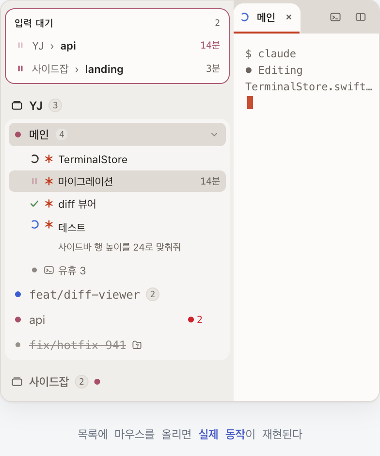
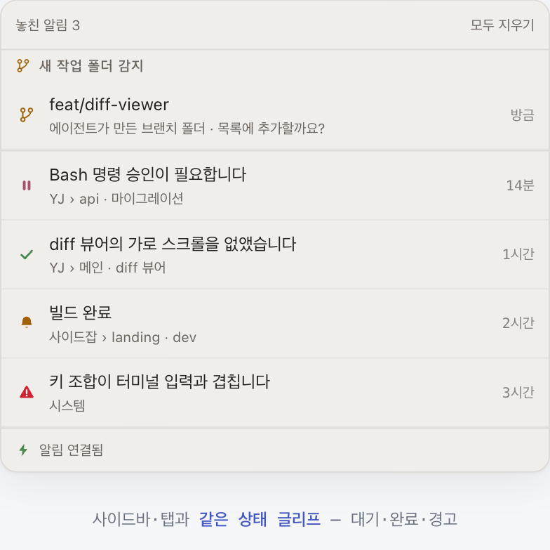
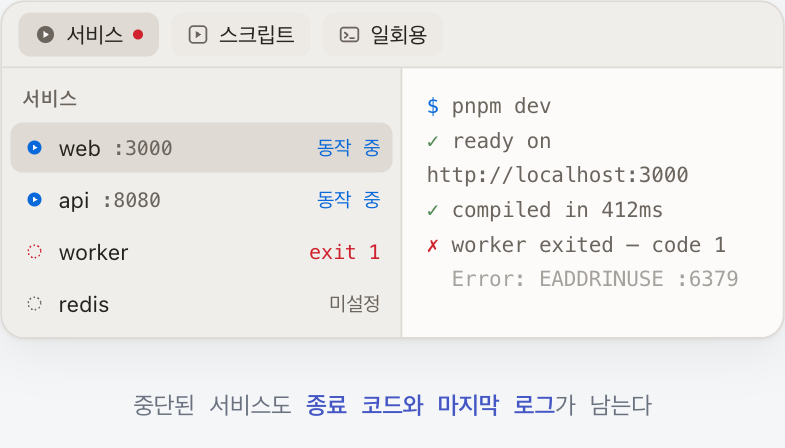

<div align="center">



# muxa

### A macOS agent terminal with a built-in document viewer and diff

Stop opening a separate editor and Git client just to see what your agent built.

**English** · [한국어](README.ko.md)

<br />

[](#build-from-source)
[](#supported-agents)
[](macos/Package.swift)
[](https://github.com/yjun1806/muxa/stargazers)

<br />



<sub><i>The left sidebar tracks running agents; the right inspector handles the explorer, Git, and notifications. Pane borders light up only when an agent calls for you.</i></sub>

</div>

<br />

You hand work to an agent in the terminal — but to see what it built, you end up opening an editor and a Git client anyway. Move a window to read one README, move another to view a diagram. **muxa** puts the file explorer, the markdown/code viewer, and diffs in the same window as the terminal. Documents show up rendered, and changes are drawn on top of them.

It also splits sessions across panes. The name is **mux + a(gent)** — a terminal multiplexer with eyes added. The terminal core **embeds [ghostty](https://ghostty.org) directly**: not a webview imitation, but a real GPU-drawn terminal inside.

> **A personal project, shared as-is.** Not a commercial product, and there's no support — updates are irregular and may stop entirely. There's no distributable `.dmg` or notarization either; you **clone and build it yourself** if it's useful to you. → [Build from source](#build-from-source)
>
> **Claude Code only, for now.** Notifications and status come first from a Claude Code hook, so everything is tuned to Claude Code today. Other agents are on the roadmap. → [Supported agents](#supported-agents)

<br />

## Why muxa?

Even after moving my coding work onto agents in the terminal through Claude Code, checking the result still needed another app. Open a Git GUI, open VSCode, and once I'd looked, back to the terminal. That round trip is what this fixes.

So the "terminal quality" muxa polishes isn't renderer fidelity. It's the **reading experience** — showing documents as documents, marking changes on top of their original shape, and gathering the state of many sessions into one list.

<br />

## Features

<table>
<tr>
<td width="54%"></td>
<td width="46%" valign="top">

### Documents, rendered

Markdown is drawn with tables and **even mermaid diagrams** — you see the design an agent drew as a picture, not as syntax. Code gets syntax highlighting and line numbers; images and video open right there too. When an agent edits a file the viewer refreshes on its own, and **your scroll position stays put** — it doesn't jump to the top.

</td>
</tr>

<tr>
<td width="46%" valign="top">

### File explorer

A tree with the same colored icons as VSCode (Material Icon Theme), so file types read by color first. A file's name color also tells you its git status. Double-click to open it in the viewer; right-click to open a terminal right there. Create, rename, and delete happen in the explorer too (delete moves to Trash).

</td>
<td width="54%"></td>
</tr>
</table>

<table>
<tr>
<td width="40%"></td>
<td width="60%" valign="top">

### Open many files without the clutter

When the viewer is pleasant, you open a lot of files. Then you have twenty tabs and stop using them. muxa looks at each file's kind and groups it automatically. There are only five lanes — **Docs, HTML, Code, Media, Changes** — so the top-level tabs never grow past that; inside each group you move between sub-tabs. Group tabs always keep **the same order**, so positions don't shift, and reopening the same file **jumps to its existing sub-tab** instead of duplicating it. Each sub-tab keeps its own scroll position. `⌘W` closes just one sub-tab. Terminals aren't grouped — the lanes are viewer-only.

</td>
</tr>

<tr>
<td width="60%" valign="top">

### Review changes on the rendered document

Agents don't only touch code. They keep rewriting READMEs, design docs, work logs. Read those as `+`/`−` patches and tables break and code blocks scramble. muxa **renders the markdown first and then paints the changes on top**, so a table stays a table and a single changed cell is the only thing highlighted. Diagrams are drawn as shapes, and a paragraph edited many times doesn't collapse into a black smear of overlapping colors. Code is a normal diff with line numbers and a minimap.

A **comment left on a changed line is sent to the terminal** — your review note becomes the next instruction. Changes you won't keep are reverted per file or per hunk. Commit and push from the terminal.

</td>
<td width="40%"></td>
</tr>
</table>

<table>
<tr>
<td width="40%"></td>
<td width="60%" valign="top">

### Sessions follow you across worktrees

Hand branches to an agent and worktrees pile up. muxa watches the repo, and the moment a new folder appears it **recognizes it immediately** and asks whether to add it as a project (it watches for changes directly, not on a polling sweep). Added worktrees line up in the sidebar and switch with one click — each keeps its own tabs, splits, and services. You can even **create a new worktree from inside the app** (pick a branch and it handles the folder and git setup).

When a session is detected running inside a worktree, a **move offer** appears above that pane. Accept it and the work moves over without breaking. But only an **∞ persistent session** — one that lives outside the app — can be transplanted; a plain terminal only gets "Go look," because muxa won't present what can't happen as if it could. If a folder is deleted, the tab isn't closed automatically: work might still be running inside, so it's only struck through and the call is left to you.

</td>
</tr>
</table>

### Closing the app doesn't kill your agents

Terminal sessions are handed to **tmux** outside the app. Quit it, force-quit it, restart for an update — the work keeps going, unlike the common approach that restores only the layout and kills the processes. With tmux installed, **new tabs are persistent (∞) by default**. That default is deliberate, because the loss is asymmetric: an unneeded persistent session is just waste, but the agent in a non-persistent tab dies irreversibly the moment you close the app. The default should be the one that survives — if you don't need it, close the tab. Without tmux, tabs open as plain shells and get no ∞ badge. It doesn't pretend.

<table>
<tr>
<td width="60%" valign="top">

### See who's waiting on you at a glance

Working, waiting, and done are spoken by **the same symbols across pane borders, tabs, the sidebar, and the notification list** (spinner, ⏸, ✓). Sessions waiting for approval collect in a queue card at the top of the sidebar; sessions with no activity fold into "Idle N" so only the ones needing attention stay as individual rows. The last instruction you sent can ride along on a second line, so you know where things stand without opening the pane. Split work and personal projects into workspaces (`⌘1`/`⌘2`), and worktrees of the same repo line up alongside.

</td>
<td width="40%"></td>
</tr>
</table>

<table>
<tr>
<td width="40%"></td>
<td width="60%" valign="top">

### Notifications — approvals and completions

When an agent asks for approval or finishes, a macOS notification fires. Ones you miss while away pile up in an inbox, and **the body carries the agent's last words verbatim** (an actual result summary, not a canned line). Pick one to jump to its pane. The icons are **the same status glyphs** as the sidebar and tabs, so there's nothing new to learn.

To turn notifications on, connect Claude Code to signal muxa **once** (a button under the inbox; your existing config is backed up). Connected, it tells approval-waiting from done precisely; before connecting it **guesses** idle when the screen goes quiet — and the app doesn't hide that it's guessing.

</td>
</tr>
</table>

### Splits and tabs — a different agent per pane

Split the screen to any ratio and run a different session in each pane. Focus is shown **by brightness only** — unselected panes dim, no border appears. **Borders are reserved for notifications** — approval-waiting blinks, done is steady — so even with four panes you instantly tell which one needs you. Each pane has its own tab bar, and a mark on the left of a tab is the status of the agent inside it. An **∞ before the title means a persistent session**. `⌘F` searches the whole scrollback.

<table>
<tr>
<td width="60%" valign="top">

### Services — run independently of tabs

Run a dev server or file watcher in a tab and it dies when you close the tab. muxa manages these in a **bottom dock** instead. Three kinds: **Services** (long-running — port and status always shown), **Scripts** (run on demand — built automatically from your Makefile if there is one), and **One-off** (keeps running even if you close the tab or switch projects). When one stops, **its exit code and last logs are kept** and a count appears next to the project name in the sidebar. It **doesn't auto-restart** — restart loops overwrite the logs and hide the cause. The service features need tmux.

</td>
<td width="40%"></td>
</tr>
</table>

**Also** — Claude usage display (session and weekly limits, down to the reset) · window detach (pop a pane into its own window and merge it back without killing the shell) · session restore (split tree, tabs, cwd) · `⌘K` command palette · resume a dropped session (bring a dead agent back with `--resume`; the app finds the session number).

<sub>The grouping, worktree, status, notifications, and services screens are mockups that reproduce the real UI on the web; the other four are actual app screenshots.</sub>

<br />

## Build from source

There's no prebuilt binary, so you **build from source**. No zig required — the terminal core is downloaded prebuilt, not compiled.

**You need**: macOS 14+ · Xcode Command Line Tools (`xcode-select --install`)

```sh
git clone https://github.com/yjun1806/muxa.git
cd muxa
./scripts/bootstrap.sh   # install GhosttyKit.xcframework (once; pinned-SHA download)
make app                 # build & run as an .app bundle (proper icon & system notifications)
```

`make app` launches a proper app with an icon and bundle id. To install into `/Applications`, use `make install` (release build). Full setup and upgrade steps are in **[docs/SETUP.md](docs/SETUP.md)**.

### External tools you need

| Tool | Used for | |
|---|---|---|
| `git` | diff, history, worktrees | required |
| `tmux` | persistent sessions, services, scripts (the app shows the install command if missing) | optional |
| `gh` | PR badges | optional |

### First-run permissions

- **Notifications** — tells you when an agent is waiting on you (deny it and things still pile up in the in-app inbox).
- **Folder access** (Documents, Desktop, Downloads) — opens projects in those folders and reads their git status. Deny it and the file tree stays empty.

To receive notifications, connect Claude Code once so it signals muxa. Press the **Install** button under the inbox; your existing config is backed up. It works without connecting, but status detection falls back to guessing from what changes on screen.

**Settings**: app menu › `Open config file…` (`⌘,`) — a commented default is created at `~/.config/muxa/config`, and saving applies immediately.
**Shortcuts** are all in the `Commands` menu in the menu bar.

<br />

## What it doesn't do

muxa focuses on one thing: **a local workspace for driving several agents at once**. The following are out of scope by design or not yet supported.

- **It doesn't edit code.** Every viewer is read-only. Agents change code; you read and decide. When you need to touch it yourself, open a separate editor.
- **Claude Code only.** Status and notifications are tuned to Claude Code. Other agents run in the terminal fine, but their status isn't tracked precisely.
- **macOS only.** Runs on macOS 14+. No Windows or Linux plans.
- **No remote status.** It's a terminal, so `ssh`-ing into another server works. But notifications and status detection rely on a local hook and socket, so an agent running remotely won't show its waiting/done state. There's no phone companion either.

<br />

## Supported agents

**Claude Code only** for now. Notifications and status come first from a Claude Code hook (`muxa-notify`), so the full status model (working, waiting, done, idle) is tuned to Claude Code. Other CLI agents run in a terminal fine, but precise notifications are complete only on Claude Code today.

Support for other agents (Codex, Gemini, …) is on the **roadmap**.

<br />

## Credits & license

muxa is **MIT-licensed** — see [LICENSE](LICENSE). It's a personal project, provided as-is (see the note at the top). Build it if it's useful to you.

**Built on / bundles** (full texts in [THIRD-PARTY-NOTICES.md](THIRD-PARTY-NOTICES.md)):

- [**ghostty**](https://github.com/ghostty-org/ghostty) — the terminal core, embedded as a prebuilt `GhosttyKit.xcframework` (MIT)
- [**Bonsplit**](https://github.com/yjun1806/bonsplit) — split/tab framework (MIT; our fork of `manaflow-ai/bonsplit`, orig. `almonk/bonsplit`)
- [markdown-it](https://github.com/markdown-it/markdown-it) (MIT) · [highlight.js](https://github.com/highlightjs/highlight.js) (BSD-3-Clause) · [Mermaid](https://github.com/mermaid-js/mermaid) (MIT) · [Shiki](https://github.com/shikijs/shiki) (MIT) — document/code rendering
- [Material Icon Theme](https://github.com/PKief/vscode-material-icon-theme) — file-tree icons (MIT)

**Referenced for design** (no code copied) — [**cmux**](https://github.com/manaflow-ai/cmux) (GPL-3.0) and orca were studied as reference implementations for the native Swift + libghostty approach and feature design.
